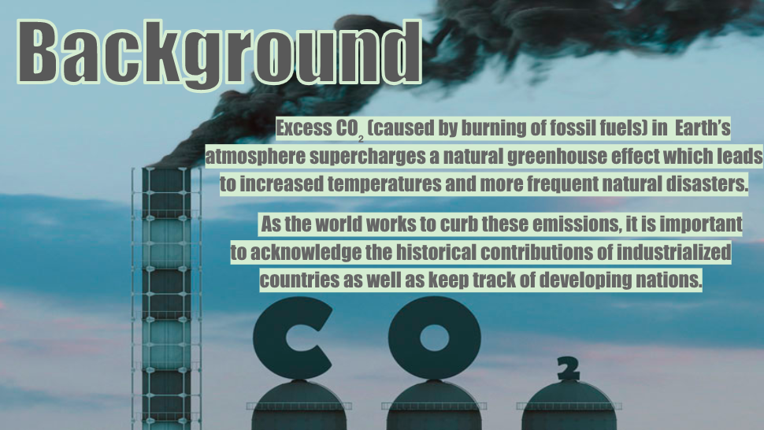
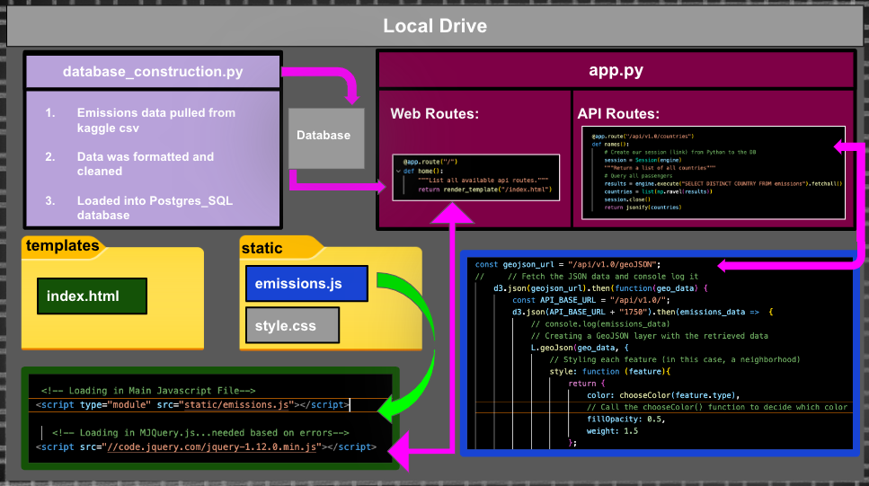

# Visualizing Data: Geographic CO₂ Emissions Since 1750

## Project Structure:

## Additional Background:
Although many air pollutants resulting from human activity contribute to climate change (including methane, nitrous oxide, black carbon and others), carbon dioxide continues to be the primary contributor. While carbon dioxide is an essential heat-radiating component of the Earth's atmosphere, too much of it intensifies the natural greenhouse effect resulting in higher temperatures. These superfluous carbon dioxide (CO₂) emissions are a direct result of energy and material production from a variety of sources and fuel types, including coal, oil, gas, cement production, and gas flaring. As both domestic and global energy systems have developed through centuries and decades, so has the spatial and temporal distribution of diverse fuel sources contributing to CO₂ emissions. In this project, we depict the breakdown of CO₂ emissions by country overtime, along with historical and recent data on the major CO₂ emitters.

## Methodology:
After reviewing many potential datasets, we chose to work with a Kaggle CSV that houses data on regional carbon dioxide emissions (measured in tons) starting at the halfway point of the 18th century, the beginning of the industrial revolution. We first reviewed and cleaned this dataset to eliminate irrelevant categories (such as calling codes and country abbreviations) and decided to structure our data into six cumulative 50-year segments starting with 1750. The most recent year included in our data set was 2020 so a seventh layer was added which spans only twenty years (2000 - 2020). After initially creating distinct API routes for each of these seven selected years, we were able to abridge our code by refining our SQL queries. **We also incorporated the chart.js library to create interactive bar charts that display exact emission values for the top and bottom contributing countries via mouse over event elements.** 

### Project Steps
* 1) Run cleaning_c02_df Jupyter notebook (this cleans your dataset)
* 2) Load data into SQL database using Creating_Engine Jupyter notebook (IMPORTANT: Ensure to create all column headers in lowercase format and update the pgadmin username and passwords with your own. Your code will not run otherwise!)
* 3) Run the app.py file through your terminal to establish the flask connection and launch the website. 

## Objective:
The primary goal of our project was to display our cleaned data via an intuitive, interactive map-based data visualization within our own website. We chose to house our data in a PostgresSQL database using pgAdmin and SQLAlchemy for Python. Our data was then read into our code using Python Flask API routes. Leaflet, an open-source Javascript library was used along with other HTML and CSS components to further edit our final product. Additionally, geoJSON files containing latitude and longitude measurements (for each of the 220 countries included in our dataset) were pulled from a public GitHub repository and read into our app.py via the previously mention API routes.  

## Project Contributors:
1. Joan Adebowale
2. Tanner Horton
3. Brandyn Jackson
4. Bronwyn Milne

## Limitations:
Since our dataset concluded with the year 2020, we planned to webscrape carbon dioxide emissions data for the years 2021 and 2022. With a limited timeframe to complete this project we were unable to complete this step, but would welcome future collaboration to retrieve this data. We also hoped to graph the relationship between the top-polluting countries and their overall populations via more dynamic line graphs using the chartist (javascript) library. 

## Data Clean Up
Initially our data frame (CSV) was normalized in jupyter notebook and then imported into PostgresSQL using alchemy pathways. We then encountered some issues within PGAdmin concerning the percentage columns listing each countries' surface area in relation to the overall global surface area. The solution ended up being to change these column data types to float via alter table queries. Column header were then abbreviated to avoid errors from the inclusion of units within parentheses. Finally, we made changes within PGAdminin to allow for null values within the dataset.

## References:

https://www.kaggle.com/datasets/moazzimalibhatti/co2-emission-by-countries-year-wise-17502022

https://www.openstreetmap.org/#map=2/42.6/9.1

https://www.github.com/johan/world.geo.json

https://www.iass-potsdam.de/en/output/dossiers/air-pollution-and-climate-change#:~:text=These%20short%2Dlived%20climate%2Dforcing,to%20global%20warming%20after%20CO2

https://www.fs.usda.gov/ccrc/topics/air-pollution#:~:text=Air%20pollutants%20that%20play%20a,including%20black%20carbon%2C%20soot)

https://www.c2es.org/document/multi-gas-contributors-to-global-climate-change/#:~:text=The%20non%2DCO2%20GHGs%20emitted,and%20sulfur%20hexafluoride%20(SF6)

https://www.ourworldindata.org/emissions-by-fuel

https://www.climate.gov/news-features/understanding-climate/climate-change-atmospheric-carbon-dioxide

https://www.ces.fau.edu/nasa/module-4/causes/sources-carbon-dioxide.php#:~:text=During%20combustion%20or%20burning%2C%20carbon,and%20water%20when%20they%20burn.
